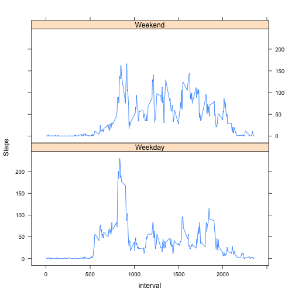

##Loading the data


```r
activity_data<-read.table("/Users/cmichael/Downloads/activity.csv",sep=",",header=TRUE)
```

##What is the mean total steps taken per day?

To answer this question we summarise the data using the ddply function in the plyr package. We build a histogram of the summarised data using the base plotting system and compute the mean and median of the distribution. 

```r
library(plyr)
data <- ddply(activity_data, .(date), summarise, total_steps=sum(steps, na.rm=TRUE))
total_step_mean <- mean(data$total_steps)
total_step_median <- median(data$total_steps)
hist(data$total_steps, main="Histogram with Missing Values", breaks = 10, xlab="Total Steps", ylab="Frequency")
```

 

The mean of the total number of steps taken per day is 9354.23 and the median of the total steps taken per day is 10395 .

##What is the average daily activity pattern?

We use the ddply function from the plyr package to summarise the data, and we use this summary to answer the question which 5-minute interval, on average across all the days in the dataset contains the maximum number of steps.


```r
daily_data <- ddply(activity_data, .(interval), summarise, d_steps=mean(steps, na.rm=TRUE))
max_interval <- daily_data[ which.max( daily_data$d_steps ),1]    
max_steps <- daily_data[ which.max( daily_data$d_steps ),2]   
plot(daily_data$interval,daily_data$d_steps,type="l", main="Time Series of Average Steps Taken", 
     ylab="Average Steps", xlab="Interval")
```

 

The maximum number of steps 206.17 is taken in interval 835.

##Imputing missing values


```r
missing_values <- sum(is.na(activity_data$steps))
```
There are 2304 missing values in the data set. 

###Strategy

The strategy we choose to replace the missing values with is the mean interval average. This will create a new dataset `na_data` with the NA's replaced. 

```r
na_data <- ddply(activity_data, .(interval), mutate, daily_steps=mean(steps, na.rm=TRUE))
na_data$steps[is.na(na_data$steps)] <- na_data$daily_steps[is.na(na_data$steps)] 
```

With the updated data set we build another histogram and compute the new mean and median of the distribution. 


```r
new_data <- ddply(na_data, .(date), summarise, total_steps=sum(steps, na.rm=TRUE))
new_total_step_mean <- mean(new_data$total_steps)
new_total_step_median <- median(new_data$total_steps)
hist(new_data$total_steps, main="Histogram with Imputed Values", breaks = 10, xlab="Total Steps", ylab="Frequency")
```

 

We note that the new value of the mean 10766 is different from the old value of the mean 9354 and the new median 10766 is different from the old median  10395. By using the averages to replace the NAs we have increased both the average and median. The changes in the histograms may highlight the difference the greatest. In the first histogram there were 10 occurences of total steps less than 2500 and approximately 15 occurences(could be 16) of between 10,000 and 12,500 steps. In the second histogram with the imputed values, the occurences of less than 2500 steps drops below 5(it appears to be 2) and the number of occurences of between 10,000 to 12,500 steps jumps to above 20. 

##Are there differences in activity patterns between weekdays and weekends?

To solve this problem we use the weekdays function to feed in a date and get the day of the week. We create a weekend vector consisting of Saturday and Sunday. Using the factor function we create a new column with each day classified as either a Weekday or Weekend. We then use the ddply function to summarise the data to get an activity pattern. We use the lattice graphing package to create a panel plot of the time series to be able to compare weekend and weekday activity. 

```r
library(lattice)
na_data$day <- weekdays(as.Date(na_data$date))
weekend <- c("Saturday","Sunday")
na_data$wday <- factor( na_data$day %in% weekend, labels=c("Weekday","Weekend"))
some_data <- ddply(na_data, .(interval, wday), summarise, d_steps=mean(steps))
xyplot(d_steps ~ interval | wday, data=some_data, layout=c(1,2), type="l", ylab="Steps")
```

 

The 2 plots show that there is a difference between weekday and weekend activity. The two highlights to note are 

1) The subject appears to wake later on the weekend, while on the a weekday there is an abrupt start near interval 500. 

2) There is a large spike on the weekday around interval 800, larger than really any other spikes throughout the day, while on the weekend we see a series of spikes all with approximately the same magnitude throughout the day.  
